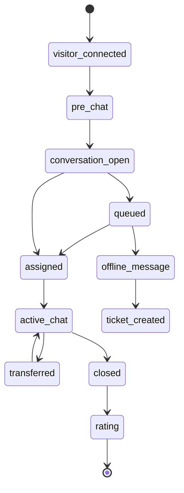
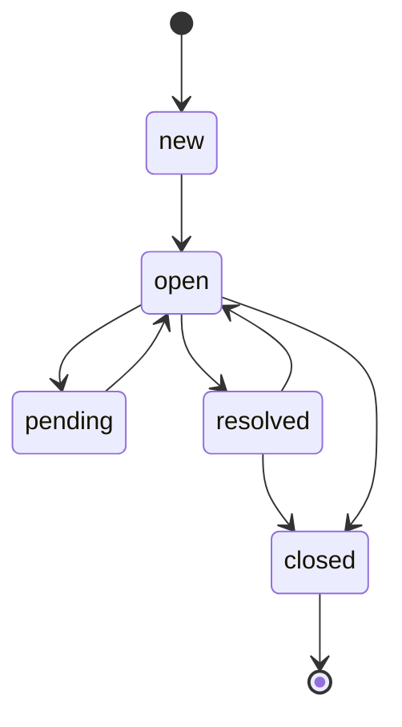
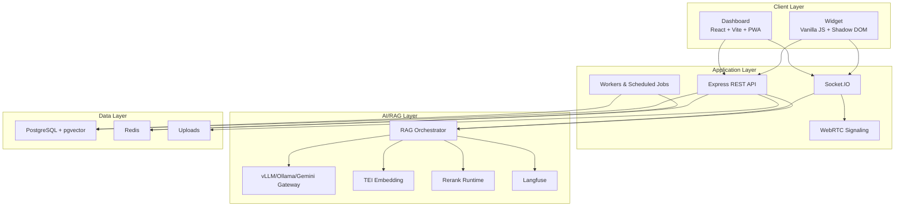

# AsistTR

**AsistTR**, kurumların ziyaretçi, öğrenci, müşteri ve destek taleplerini tek bir panelden yönetebilmesi için geliştirilen self-hosted canlı destek, ticket, bilgi tabanı ve AI asistan platformudur.

Platform; gömülebilir web widget'ı, temsilci/yönetici dashboard'u, gerçek zamanlı mesajlaşma, WebRTC görüşme altyapısı, çok siteli yetkilendirme, gelişmiş RAG tabanlı yapay zeka ve operasyonel izleme bileşenlerini tek ürün çatısı altında toplar.

> Bu README yayınlanabilir ürün ve teknik kapsam dokümanıdır. Sunucu yapılandırması, gizli anahtarlar ve çalıştırma komutları bu dosyada yer almaz.

## İçindekiler

- [Ürün Özeti](#ürün-özeti)
- [Ana Modüller](#ana-modüller)
- [Kod Hacmi](#kod-hacmi)
- [Kullanıcı Rolleri ve Yetki Modeli](#kullanıcı-rolleri-ve-yetki-modeli)
- [Dashboard Ekran Kataloğu](#dashboard-ekran-kataloğu)
- [Ürün Senaryoları](#ürün-senaryoları)
- [AI ve RAG Altyapısı](#ai-ve-rag-altyapısı)
- [Canlı Destek ve Widget](#canlı-destek-ve-widget)
- [Ticket ve Operasyon Yönetimi](#ticket-ve-operasyon-yönetimi)
- [Analytics ve İzleme](#analytics-ve-izleme)
- [Güvenlik ve Yetkilendirme](#güvenlik-ve-yetkilendirme)
- [Mimari](#mimari)
- [Socket.IO Olay Alanları](#socketio-olay-alanları)
- [Teknoloji Stack](#teknoloji-stack)
- [Frontend Tasarım ve Deneyim](#frontend-tasarım-ve-deneyim)
- [API Yüzeyi](#api-yüzeyi)
- [Veri Modeli](#veri-modeli)
- [Arka Plan Servisleri](#arka-plan-servisleri)
- [Kaynak Kod Organizasyonu](#kaynak-kod-organizasyonu)
- [Lisans](#lisans)

## Ürün Özeti

AsistTR; üniversiteler, kamu kurumları, şirketler ve yoğun destek trafiği olan ekipler için tasarlanmış kurumsal bir iletişim platformudur.

Öne çıkan kabiliyetler:

- Çok siteli yapı: tek panelden birden fazla site/kurum yönetimi
- Rol tabanlı erişim: `superadmin`, `admin`, `agent`, `customer`
- Gömülebilir widget: Shadow DOM izolasyonlu, ayarlanabilir canlı destek arayüzü
- Gerçek zamanlı destek: Socket.IO ile mesaj, typing, okundu bilgisi ve canlı durum
- WebRTC iletişim: sesli görüşme, görüntülü görüşme, ekran paylaşımı ve çizim desteği
- Ticket sistemi: SLA, kilitleme, kategori, şablon, filtre, CSV export ve email akışları
- AI asistan: vLLM/Ollama uyumlu yerel LLM, Gemini fallback, TEI embedding, pgvector, rerank ve Smart Cache
- Bilgi tabanı: yönetilebilir yardım makaleleri, RAG kaynakları, dosya yükleme, URL scraping ve bilgi açığı takibi
- Operasyon paneli: canlı ziyaretçi, kuyruk, agent performansı, sistem kaynakları, AI monitor ve Langfuse gözlemlenebilirliği
- Güvenlik katmanları: JWT, domain whitelist, CORS ayrımı, rate limit, XSS temizleme, içerik moderasyonu ve prompt-injection kontrolleri

## Ana Modüller

| Modül | Kapsam |
| --- | --- |
| Dashboard | Yönetici ve temsilci paneli, PWA desteği, site seçici, tema yönetimi |
| Widget | Ziyaretçi tarafı canlı destek arayüzü, Shadow DOM izolasyonu, özelleştirilebilir görünüm |
| Chat | Mesajlaşma, dosya paylaşımı, konuşma geçmişi, notlar, etiketler, transfer ve rating |
| Voice | WebRTC sesli/görüntülü görüşme, ekran paylaşımı, TURN credential üretimi, çağrı geçmişi |
| Ticket | Talep yönetimi, SLA, kilit, reply, attachment, kategori, şablon, filtre, email entegrasyonu |
| Offline Messages | Mesai dışı veya agent yokken alınan çevrimdışı mesajların yönetimi ve ticket'a dönüşümü |
| AI/RAG | Bilgi tabanı arama, streaming yanıt, agentic RAG, Smart Cache, knowledge gaps, RAGAS/validator |
| Analytics | Canlı ziyaretçi takibi, sayfa geçmişi, trafik kaynakları, cihaz istatistikleri, heatmap |
| CRM | Kişiler, engellenen kullanıcılar/IP'ler, müşteri profili ve ziyaretçi geçmişi |
| Team Chat | Ekip içi mesajlaşma, pin, arama ve okunma durumu |
| Settings | Site, widget, iş saatleri, SMTP, bildirim, logo ve çoklu site ayarları |

## Kod Hacmi

AsistTR kaynak kodu, sayım yapılan kapsamda **334 dosyada 141.342 satır**dan oluşur.

Bu sayı fiziksel satır sayımıdır; boş satırlar ve yorum satırları dahildir. Sayıma kaynak kodu, frontend dosyaları, backend dosyaları, SQL şemaları, JSON yapılandırmaları, Dockerfile, Nginx konfigürasyonları ve compose dosyaları dahil edilmiştir. `node_modules`, lock dosyaları, build çıktıları, README ve diğer Markdown dokümanları hariç tutulmuştur.

| Alan | Dosya/Satır Kapsamı | Satır |
| --- | --- | ---: |
| Backend | API, socket, servisler, RAG, modeller, middleware, SQL | 64.722 |
| Dashboard | React sayfaları, componentler, store, servisler, PWA ve stil dosyaları | 49.070 |
| Widget | Gömülebilir widget, modüller, mesajlaşma, voice, UI ve tracking | 25.149 |
| Kök yardımcı dosyalar | JSON/HTML gibi repo kökünde duran kaynaklar | 1.576 |
| Compose | Ortam/topoloji tanımları | 709 |
| Nginx | Reverse proxy konfigürasyonu | 116 |
| **Toplam** | 334 dosya | **141.342** |

Dosya türüne göre kırılım:

| Tür | Dosya | Satır |
| --- | ---: | ---: |
| JavaScript | 218 | 86.006 |
| JSX | 87 | 40.351 |
| HTML | 6 | 4.505 |
| CSS | 1 | 4.685 |
| SQL | 4 | 3.591 |
| JSON | 6 | 961 |
| YAML | 3 | 709 |
| Nginx/Conf | 3 | 209 |
| Dockerfile | 5 | 134 |
| MJS | 1 | 191 |

## Kullanıcı Rolleri ve Yetki Modeli

AsistTR'nin yetki modeli global rol ve site rolünü birlikte değerlendirir. Bu sayede aynı kullanıcı farklı sitelerde farklı yetkilerle çalışabilir.

| Rol | Temel Yetki |
| --- | --- |
| `superadmin` | Tüm siteleri, global ayarları, AI operasyonunu ve yönetim modüllerini görür |
| `admin` | Yetkili olduğu site veya sitelerde temsilci, departman, widget, ticket ve ayar yönetir |
| `agent` | Sohbet, ticket, bilgi tabanı ve kendi operasyonel ekranları üzerinden destek verir |
| `customer` | Kalıcı müşteri/talep ilişkileri için ayrılmış roldür |

Yetki davranışları:

- Her dashboard isteği aktif site bağlamını taşır.
- `X-Site-Id` ile seçilen site, `user_sites` tablosundan doğrulanır.
- Superadmin tüm site bağlamlarına geçebilir.
- Admin sadece yetkili olduğu sitelerde yönetim yapar.
- Agent operasyonel ekranları görür; site, widget ve sistem ayarları gibi alanlar kısıtlanır.
- Site rolü global rolden önceliklidir; bu, çok siteli kurumlarda daha esnek yetkilendirme sağlar.

## Dashboard Ekran Kataloğu

Dashboard React/Vite tabanlıdır, PWA olarak çalışabilir ve ekranlar lazy-load edilir. Menü aktif role göre değişir.

### Ortak Operasyon Ekranları

| Ekran | Amaç |
| --- | --- |
| Ana Sayfa | Genel operasyon özeti, hızlı durum göstergeleri ve panel başlangıcı |
| Sohbetler | Canlı konuşmalar, mesajlaşma, AI önerileri, notlar, etiketler ve WebRTC kontrolü |
| Canlı Ziyaretçiler | Anlık ziyaretçi listesi, aktif sayfa, cihaz, davranış ve session bilgisi |
| Kuyruk | Sohbet kuyruğu, bekleyen ziyaretçiler, tahmini süreler ve manuel atama |
| Durum Yönetimi | Agent müsaitlik, mola, meşgul, uzak ve çevrimdışı durumları |
| Tüm Ticketlar | Ticket listesi, Kanban görünümü, filtreler, toplu işlem ve detay modalı |
| Kişiler | Ziyaretçi/müşteri profilleri, geçmiş etkileşimler ve ban yönetimi |
| Hazır Yanıtlar | Temsilci yanıt şablonları, kısayollar ve kategori yönetimi |
| Analitik | Destek, ziyaretçi, trafik, cihaz ve konuşma metrikleri |
| Değerlendirmeler | CSAT/rating sonuçları ve konuşma memnuniyet verileri |
| Bilgi Tabanı | RAG kaynaklarının listelenmesi, aranması ve test edilmesi |
| Yardım Makaleleri | Widget içinde gösterilebilen makale ve kategori yönetimi |
| Profil Ayarları | Kullanıcının kendi hesap ve tercih bilgileri |

### Admin ve Superadmin Ekranları

| Ekran | Amaç |
| --- | --- |
| AI Komuta Merkezi | LLM provider, rerank, kaynak kullanımı, GPU/RAM, queue ve AI metrikleri |
| Smart Cache | Sık sorulan soruların cache/alias yönetimi, varyasyon üretimi, backup/restore |
| Ticket Filtreleri | Kaydedilmiş ticket görünüm ve filtreleri |
| Ticket Kategorileri | Ticket kategorisi, renk, ikon ve SLA varsayılanları |
| Ticket Şablonları | Hazır ticket oluşturma şablonları |
| Email Şablonları | Ticket lifecycle mail şablonları |
| Dinamik Formlar | Widget ve ticket akışları için özel form alanları |
| SLA Politikaları | Yanıt ve çözüm süreleri için politika yönetimi |
| Agent Yönetimi | Temsilci CRUD, rol, kapasite ve site ilişkileri |
| Departmanlar | Departman CRUD ve routing organizasyonu |
| AI Eğitim Merkezi | RAG doküman ekleme, bulk upload, URL scraping, RAPTOR/Graph seçenekleri |
| Agentic RAG Analitiği | Agentic retrieval, araç çağrısı ve kalite metrikleri |
| Langfuse Observability | LLM/RAG trace ve generation gözlemlenebilirliği |
| Takımlar | Ekipler, üyeler ve takım bazlı çalışma organizasyonu |
| Engellenenler | Kullanıcı/IP ban listesi, strike kayıtları ve moderasyon logları |
| Ayarlar | Site, logo, iş saatleri, SMTP, bildirim ve genel ayarlar |

## Ürün Senaryoları

### Senaryo 1: Mesai İçi ve Agent Müsait

1. Ziyaretçi widget'ı açar.
2. Site API key'i ve domain doğrulaması yapılır.
3. Ziyaretçi form veya doğrudan sohbet ile konuşma başlatır.
4. Routing katmanı müsait agent arar.
5. Konuşma agent dashboard'una düşer.
6. Agent konuşmayı kabul eder veya sistem uygun atamayı yapar.
7. AI öneri üretebilir; agent düzenleyerek veya doğrudan yanıtlayarak devam eder.
8. Ziyaretçi rating verir, transcript isteyebilir veya konuşma kapatılır.

### Senaryo 2: Agent Yok veya Tüm Agentlar Meşgul

1. Ziyaretçi konuşma başlatır.
2. Sistem agent kapasitesi ve durumlarını kontrol eder.
3. Uygun agent yoksa ziyaretçi kuyruğa alınır.
4. Kuyruk pozisyonu ve tahmini bekleme bilgisi socket üzerinden güncellenir.
5. AI asistan devreye girerek RAG kaynaklarından yanıt verebilir.
6. Agent müsait olduğunda kuyruktaki konuşma atanır.
7. Bekleme veya mesai dışı durumda offline message/ticket akışına geçilebilir.

### Senaryo 3: Mesai Dışı Destek

1. Widget iş saatleri bilgisini kontrol eder.
2. Canlı agent akışı kapalıysa ziyaretçiye alternatifler gösterilir.
3. Ziyaretçi AI ile devam edebilir, offline mesaj bırakabilir veya ticket oluşturabilir.
4. Talep email ve dashboard kanallarında takip edilebilir.
5. SLA politikası varsa iş saati mantığıyla süre hesaplanır.

### Senaryo 4: Bilgi Tabanı ile Otomatik Yanıt

1. Ziyaretçi soru sorar.
2. Mesaj içerik moderasyonu ve prompt-injection kontrollerinden geçer.
3. Soru analiz edilir; gerekirse alt sorgulara ayrılır.
4. Bilgi tabanında hibrit arama yapılır.
5. Rerank açıksa adaylar yeniden sıralanır.
6. Smart Cache sonucu varsa hızlı yanıt döner.
7. LLM bağlama dayalı yanıt üretir.
8. Validator yanıtı kaynaklara göre kontrol eder.
9. Yanıt streaming olarak widget ve dashboard'a düşer.

### Senaryo 5: Email ile Ticket

1. Kuruma gelen destek maili email-to-ticket servisi tarafından işlenir.
2. Mail parse edilir, ilgili site ve hesapla eşleştirilir.
3. Konu içindeki ticket numarası varsa mevcut ticket'a reply eklenir.
4. Yeni talepse ticket oluşturulur.
5. Otomatik yanıt şablonlarıyla kullanıcı bilgilendirilir.
6. Agent dashboard'dan ticket'ı devralır ve yanıt verir.

## AI ve RAG Altyapısı

AsistTR'nin AI katmanı sadece basit bir sohbet botu değildir; bilgi tabanı, kaynak denetimi, cache, değerlendirme ve canlı operasyon kontrolüyle birlikte çalışır.

Temel bileşenler:

- LLM gateway: `auto`, `gemini`, `vllm` modları
- Yerel/özel model desteği: OpenAI uyumlu vLLM endpoint'i veya Ollama native chat endpoint'i
- Gemini fallback: kota/hata durumlarında circuit breaker ve yerel modele dönüş
- Embedding: TEI üzerinden `BAAI/bge-m3`
- Rerank: opsiyonel cross-encoder rerank servisi, runtime aç/kapat desteği
- Vektör arama: PostgreSQL `pgvector` ve HNSW index
- Hibrit retrieval: metin arama, vektör arama, başlık/metadata sinyalleri ve skor birleştirme
- HyDE fallback: zayıf aramalarda varsayımsal doküman üreterek aramayı genişletme
- Query decomposition: karmaşık soruları alt sorgulara bölme
- Agentic RAG: araç çağırabilen, ek aramalarla bağlamı zenginleştiren akış
- RAPTOR: uzun dokümanlar için hiyerarşik özetleme ve indeksleme
- HippoRAG2: ilişkisel bellek, Hebbian güçlendirme ve zamanla zayıflatma mantığı
- Smart Cache: tekrar eden sorular için varyasyon/alias yönetimi, backup/restore ve cache dashboard'u
- Knowledge gaps: AI'ın cevaplayamadığı veya zayıf kaldığı soruların kayıt altına alınması
- Validator: halüsinasyon kontrolü, güvenilirlik işaretleri ve standart "cevap yok" davranışı
- Langfuse: RAG adımları, LLM çağrıları, latency ve kalite izleme
- AI queue: Redis/BullMQ tabanlı iş kuyruğu ve concurrency kontrolü

RAG akışının sade görünümü:

```mermaid
flowchart LR
    A["Ziyaretçi veya agent mesajı"] --> B["Güvenlik ve moderasyon kontrolleri"]
    B --> C["Query analizi ve gerekirse decomposition"]
    C --> D["Knowledge retrieval"]
    D --> E["Vector + text + metadata skorları"]
    E --> F["Opsiyonel rerank"]
    F --> G["Smart Cache ve context hazırlığı"]
    G --> H["LLM generation"]
    H --> I["Validator ve kaynak kontrolü"]
    I --> J["Streaming cevap ve metrik kaydı"]
```



### RAG Modları

| Mod | Davranış |
| --- | --- |
| Fast | Daha düşük gecikme hedefler, kısa bağlam ve hızlı cevap için kullanılır |
| Deep | Daha geniş retrieval, rerank, query decomposition ve daha güçlü bağlam hazırlığına odaklanır |
| Agentic | Araç kullanımı, ek arama, bağlam zenginleştirme ve çok adımlı karar süreci çalıştırır |
| Auto | Soru karmaşıklığına, ayarlara ve sistem durumuna göre uygun yolu seçer |

### Knowledge Ingestion

Bilgi ekleme akışı sadece metni veritabanına yazmaz; içeriği RAG için hazırlanabilir hale getirir.

Desteklenen kaynak tipleri:

- Manuel metin girişi
- Tekil dosya yükleme
- Toplu dosya yükleme
- URL scraping
- HTML içerikli yardım makaleleri
- PDF, Word ve OCR gerektiren içerikler
- Metadata, kategori ve etiketlerle zenginleştirilmiş kaynaklar

İşleme adımları:

1. İçerik temizlenir ve normalize edilir.
2. Uzun metinler chunk'lara bölünür.
3. Metadata, kategori ve etiket bilgileri hazırlanır.
4. TEI ile embedding üretilir.
5. PostgreSQL `knowledge_base` tablosuna içerik ve vektör yazılır.
6. Uygunsa RAPTOR hiyerarşik özetleri oluşturulur.
7. Smart Cache ilgili kaynak değiştiğinde geçersizleştirilir.
8. Job tracker üzerinden durum dashboard'a aktarılır.

### Query Decomposition

Karmaşık sorular tek aramayla cevaplanmaya çalışılmaz. Sistem:

- Soru uzunluğunu ve çoklu soru işaretlerini değerlendirir.
- Gerektiğinde alt sorgular üretir.
- Her alt sorgu için ayrı retrieval yapar.
- Sonuçları deduplicate eder.
- Final rerank ile bütün adayları tek sıralamada toplar.
- LLM'e daha bütünlüklü context sunar.

### Smart Cache

Smart Cache sadece string eşleşmesi değildir. Soru varyasyonlarını, canonical kayıtları ve alias ilişkilerini yönetir.

Öne çıkan özellikler:

- Site bazlı cache izolasyonu
- Query hash üretimi
- Benzer soru alias'ları
- Bulk import
- Backup ve restore
- Varyasyon üretimi
- Entry güncelleme ve silme
- Cache dashboard istatistikleri

### Validator ve Güvenilir Yanıt Politikası

AI yanıtı üretildikten sonra sistem cevabın verilen bağlama dayanıp dayanmadığını kontrol eder.

Kontrol sinyalleri:

- Kaynak bağlamıyla örtüşme
- "Bilmiyorum" veya belirsizlik gerektiren durumlar
- Halüsinasyon işaretleri
- LLM judge sonucu
- Cevap güven seviyesi

Standart davranış: bilgi kaynaklarında kesin cevap yoksa kullanıcıya uydurma cevap vermek yerine sınırlı bilgi olduğunu söylemek.

### Langfuse ve AI Observability

RAG süreci Langfuse ile izlenebilir:

- Trace
- Span
- Generation
- Retrieval latency
- Rerank latency
- Validation sonucu
- Provider bilgisi
- Agentic tool çağrıları
- Cache hit/miss olayları

Bu sayede AI katmanı sadece çalışıp çalışmadığıyla değil, nasıl karar verdiğiyle de izlenebilir.

## Canlı Destek ve Widget

Widget, web sitelerine gömülebilen izole bir ziyaretçi deneyimi sağlar. Ana uygulamadan bağımsız çalışır, kendi stil alanını Shadow DOM içinde tutar ve host sitenin CSS/JS ortamından etkilenmez.

Widget özellikleri:

- Shadow DOM tabanlı izolasyon
- Canlı sohbet başlatma ve konuşma geçmişi
- Departman seçimi ve ön görüşme formları
- Dinamik form ve ticket oluşturma ekranları
- Yardım makaleleri/bilgi tabanı ekranı
- Dosya yükleme ve attachment preview
- Markdown rendering ve güvenli HTML temizleme
- Ziyaretçi rating/CSAT gönderimi
- Sesli görüşme, sesli not, ekran paylaşımı ve çizim araçları
- Proaktif tetikleyiciler: sayfa takibi, tıklama, scroll, süre ve davranış sinyalleri
- Açık/koyu tema, pozisyon ve görünüm ayarları
- CSS liquid glass görsel altyapısı ve opsiyonel WebGPU fluid arka plan modülü
- Konuşma export/transcript akışları

Dashboard tarafında temsilciler:

- Gelen sohbetleri gerçek zamanlı görür
- Konuşmayı kabul eder, atar, kapatır veya başka agente devreder
- AI önerilerini kullanır veya manuel yanıt yazar
- Mesaj düzenleme/silme, not, etiket ve arama işlemleri yapar
- Ziyaretçinin geçmiş oturumlarını, sayfa gezinmesini ve önceki görüşmelerini inceler
- Sesli/görüntülü çağrıları yönetir

### Widget Ekranları

Widget içinde birden fazla ziyaretçi deneyimi bulunur:

- İlk karşılama ekranı
- Sohbet başlatma formu
- Konuşma listesi
- Aktif konuşma ekranı
- Bilgi tabanı/makale ekranı
- Ticket formu
- Offline mesaj formu
- Rating ekranı
- Dosya upload akışı
- Sesli görüşme ve ekran paylaşımı kontrolleri

### Widget İzolasyonu

Widget host sayfayı bozmayacak şekilde tasarlanır:

- Kapalı Shadow DOM kullanır.
- CSS host sayfadan izole edilir.
- Host sayfaya yalnızca gerekli overlay gibi sınırlı elemanlar eklenir.
- Font yüklemeleri ana dokümana eklenebilir ama widget stilleri ayrıdır.
- Widget root elementi minimum etkiyle konumlanır.

### Widget Tracking

Ziyaretçi davranışları destek operasyonunu zenginleştirmek için izlenir:

- Sayfa görüntüleme
- Tıklama
- Scroll derinliği
- Sayfada kalma süresi
- Aktif/idle durumu
- Oturum geçmişi
- Ziyaretçinin mevcut URL ve sayfa başlığı

Bu veriler canlı ziyaretçi ekranında, konuşma detaylarında ve analytics raporlarında kullanılır.

### Chat Lifecycle



### Mesajlaşma Özellikleri

- Visitor, agent, bot ve system mesaj tipleri
- Streaming AI mesajları
- Düşünme/processing göstergeleri
- Read receipts
- Typing indicator
- Attachment preview
- Markdown render
- XSS'e karşı sanitize/escape
- Mesaj düzenleme ve silme
- AI yanıtını durdurma ve yeniden üretme
- Moderasyon mesajları

### WebRTC ve Voice

Sesli/görüntülü görüşme katmanı hem widget hem dashboard tarafında çalışır.

Kapsam:

- Ziyaretçi veya agent tarafından çağrı başlatma
- Çağrı kabul/red/iptal/sonlandırma
- Aktif çağrı sayacı ve agent müsaitliği
- WebRTC offer/answer/ICE signaling
- Race condition koruması
- Visitor reconnect ve heartbeat
- Ekran paylaşımı
- Agent kamera paylaşımı
- Visitor kamera izni akışı
- Ekran üzerinde çizim
- TURN credential endpoint'i
- Çağrı geçmişi ve istatistikleri

## Ticket ve Operasyon Yönetimi

Ticket katmanı canlı sohbetten bağımsız kalıcı destek süreci sunar.

Desteklenen işlevler:

- Yeni ticket oluşturma, güncelleme, kapatma, yeniden açma
- Agent atama ve ticket reply akışı
- Çevrimdışı mesajların takip edilmesi, atanması, durumlandırılması ve geçmişinin tutulması
- Ticket kilitleme: aynı talebin birden fazla kişi tarafından çakışmalı düzenlenmesini önler
- SLA politikaları ve SLA istatistikleri
- Kategoriler, etiketler, öncelikler ve özel alanlar
- Ticket şablonları ve hazır yanıtlar
- Kayıtlı ticket filtreleri
- Attachment upload ve korumalı dosya erişimi
- Toplu işlemler, merge ve CSV export
- Email account ve email template yönetimi
- IMAP/SMTP destekli email-to-ticket ve otomatik yanıt akışları
- Dynamic forms üzerinden ticket üretimi

Tipik ticket yaşam döngüsü:



### Ticket Listeleme ve Çalışma Biçimleri

Ticket ekranı yoğun operasyonlar için iki görünüm sunar:

- Liste görünümü
- Kanban görünümü

Desteklenen çalışma özellikleri:

- Arama
- Durum filtresi
- Öncelik filtresi
- Atanan kişi filtresi
- Kategori filtresi
- Takım filtresi
- "Benim ticketlarım" hızlı filtresi
- Toplu seçim
- Toplu işlem
- Sayfalama
- Kaydedilmiş filtreler
- Keyboard navigation
- Undo destekli Kanban aksiyonu
- Dashboard istatistik kartları

### Ticket Detay Modalı

Ticket üzerinde çalışırken detay modalı merkezi çalışma alanıdır.

İçerik:

- Ticket bilgileri
- Ziyaretçi/müşteri bilgileri
- Atanan agent ve takım
- Durum/öncelik/kategori
- SLA göstergeleri
- Reply listesi
- Attachment listesi
- İç not ve geçmiş
- Kilit durumu
- AI reply suggestion
- Close/reopen akışları

### SLA Mantığı

SLA politikaları ticket sürecine iş saati bilinci ekler.

Sistem:

- Ticket önceliğine göre hedef süre belirler.
- İş saatleri ve site ayarlarını dikkate alır.
- SLA istatistikleri üretir.
- Yaklaşan veya aşılmış SLA durumlarını dashboard'da gösterir.
- Ticket ekranında kalan süre veya aşım durumunu görselleştirir.

### Dynamic Forms

Dinamik form sistemi, kurumun ziyaretçiden veya müşteriden toplamak istediği bilgileri kod değişikliği olmadan yönetmesini sağlar.

Alan tipleri:

- Metin
- Çok satırlı metin
- Email
- Telefon
- Sayı
- Açılır liste
- Radio
- Checkbox
- Tarih
- Saat
- Dosya
- URL

Formlar departman, kategori, varsayılan öncelik ve ticket üretme davranışıyla ilişkilendirilebilir.

### Email Şablonları

Email şablonları ticket olaylarına bağlanır:

- Yeni ticket oluşturuldu
- Yeni reply geldi
- Ticket atandı
- Ticket çözüldü
- Ticket kapatıldı

Şablon katmanı HTML ve metin içeriklerini kurumsal dile göre yönetmeyi kolaylaştırır.

## Analytics ve İzleme

AsistTR, destek operasyonunun hem müşteri deneyimini hem de sistem performansını ölçer.

Ürün analitiği:

- Canlı ziyaretçi listesi
- Online ziyaretçi sayısı
- Ziyaretçi detayları ve session timeline
- Sayfa görüntüleme, aksiyon ve scroll/time tracking
- Top pages, trafik kaynakları ve cihaz istatistikleri
- Konuşma analitiği ve ticket analitiği
- Support heatmap
- Agent performansı, ilk yanıt süresi, çözüm süresi ve rating
- CSAT ve konuşma değerlendirmeleri

Sistem ve AI izleme:

- CPU, RAM, GPU ve sıcaklık metrikleri
- AI queue bekleyen/aktif/tamamlanan iş sayıları
- LLM provider ve rerank runtime kontrolü
- TEI/rerank CPU-GPU cihaz durumu
- RAG paralel limitleri ve kaynak baskısı seviyesi
- Smart Cache hit/miss ve alias istatistikleri
- Langfuse trace, span ve generation kayıtları
- RAGAS/evaluation metrikleri

### Ziyaretçi Analitiği

Ziyaretçi izleme canlı destek kalitesini artırır. Agent yalnızca "kim yazdı" bilgisini değil, kullanıcının bağlamını da görebilir.

Takip edilen bilgiler:

- Visitor ID
- Session ID
- Aktif sayfa
- Sayfa başlığı
- Referrer/source
- Cihaz ve tarayıcı
- IP ve coğrafi tahmin
- Sayfada kalma süresi
- Scroll davranışı
- Önceki sayfalar
- Önceki konuşmalar
- Önceki ratingler
- Etiket geçmişi

### Agent Performansı

Performans metrikleri yalnızca sayısal raporlama için değil, iş yükü dengeleme ve kalite yönetimi için kullanılır.

Ölçülen örnek metrikler:

- İlk yanıt süresi
- Ortalama yanıt süresi
- Çözüm süresi
- Aktif konuşma sayısı
- Kapanan konuşma sayısı
- Ticket çözüm oranı
- Rating ortalaması
- Online/idle süreleri
- Çağrı istatistikleri

### AI Komuta Merkezi

AI Komuta Merkezi, LLM altyapısının canlı durumunu gösterir.

İzlenen alanlar:

- CPU, RAM, GPU kullanımı
- GPU sıcaklığı ve VRAM durumu
- AI request throughput
- Ortalama latency
- Aktif stream sayısı
- Queue aktif/bekleyen/tamamlanan işler
- Rejected request sayısı
- LLM provider seçimi
- Rerank açık/kapalı durumu
- TEI ve rerank cihaz bilgisi
- Smart Cache istatistikleri
- Kaynak baskısı ve efektif paralel limit

## Güvenlik ve Yetkilendirme

Güvenlik modeli dashboard/admin trafiği ile public widget trafiğini ayrı değerlendirir.

Kimlik ve yetki:

- JWT tabanlı oturum
- Bearer token ve cookie desteği
- Şifre değişiminden sonra eski token geçersizleştirme
- Rol tabanlı erişim: `superadmin`, `admin`, `agent`, `customer`
- Multi-site context için `X-Site-Id`
- `user_sites` üzerinden site bazlı rol ve erişim kontrolü
- Superadmin için tüm site erişimi, admin/agent için site izolasyonu

Widget güvenliği:

- API key ile site doğrulama
- Domain whitelist ve subdomain eşleşme kontrolü
- Origin/Referer hostname parse ederek substring bypass engelleme
- Public widget route'larında credentials kapalı CORS
- Dashboard/admin route'larında whitelist tabanlı credentials açık CORS

Uygulama güvenliği:

- Helmet security headers
- Redis destekli rate limit; Redis yoksa kontrollü in-memory fallback
- Auth, API, AI ve upload için ayrı limit politikaları
- XSS sanitization ve HTML alanları için kontrollü istisnalar
- Ticket upload dosyalarında kimlik doğrulama
- Widget ve dashboard tarafında HTML sanitize/escape katmanları
- İçerik moderasyonu: Türkçe argo/küfür/tehdit, spam, flood, strike, mute ve otomatik ban
- Prompt injection tespit kuralları
- Docker socket erişimi için proxy yaklaşımı

### İçerik Moderasyonu

Moderasyon sistemi Türkçe destek akışına göre özelleştirilmiştir.

Kontrol kategorileri:

- Kaba/argo dil
- Hakaret
- Ağır küfür
- Tehdit veya kritik ifade
- Flood
- Link spam
- Unicode abuse
- Encoded content şüphesi
- Aşırı uzun mesaj

Strike sistemi:

| Seviye | Etki |
| --- | --- |
| Low | Hafif uyarı puanı |
| Medium | Daha yüksek strike |
| High | Ağır ihlal puanı |
| Critical | Otomatik ban seviyesine yaklaşan veya doğrudan ağır aksiyon |

Dashboard'da:

- Engellenen kullanıcılar
- Engellenen IP'ler
- Strike kayıtları
- Moderasyon logları
- Visitor moderation history
- Strike reset işlemleri

### Rate Limit Katmanları

Farklı trafik tipleri farklı limitlerle yönetilir:

- Genel API
- Auth işlemleri
- Widget mesajları
- AI/RAG istekleri
- Upload işlemleri

Redis hazırsa limit kayıtları Redis'te tutulur; Redis hazır değilse uygulama kontrollü şekilde in-memory fallback kullanır.

### Dosya Güvenliği

Dosya yükleme katmanında:

- Boyut limitleri
- MIME/type kontrolü
- Ticket dosyalarında auth zorunluluğu
- Public logo ve görseller için ayrı statik erişim
- SVG gibi riskli logo türlerinin engellenmesi
- Upload rate limit

## Mimari



Mimari prensipleri:

- REST API ve Socket.IO birlikte kullanılır; kalıcı işlemler API, canlı olaylar socket üzerinden akar.
- Widget public çalışır ama site API key'i ve domain whitelist ile sınırlandırılır.
- Dashboard tüm isteklerde aktif site bağlamı taşır.
- RAG işlemleri kaynak tüketimine göre kuyruklanır, cache'lenir ve izlenir.
- Redis; cache, rate limit, queue, Socket.IO adapter ve runtime ayar cache'i için kullanılır.
- PostgreSQL ana veri kaynağıdır; `pgvector`, `pg_trgm`, `pgcrypto` ve `uuid-ossp` uzantılarıyla genişletilir.

## Socket.IO Olay Alanları

Socket katmanı canlı deneyimin omurgasıdır.

Başlıca handler grupları:

| Handler | Sorumluluk |
| --- | --- |
| Visitor | Ziyaretçi bağlantısı, site doğrulama, konuşma odaları |
| Agent | Agent bağlantısı, presence, disconnect grace period |
| Message | Mesaj gönderme, okundu, düzenleme, silme, AI stream |
| AI | RAG tetikleme, streaming, stop/retry, queue göstergeleri |
| Voice Call | WebRTC signaling, çağrı lifecycle, ekran/kamera izinleri |
| Voice AI | Sesli AI asistan, TTS ve konuşma akışı |
| Tracking | Sayfa ve davranış takibi |
| Team Chat | Takım mesajları, pin ve okunma bilgisi |

Oda mantığı:

- Site agent odaları
- Kullanıcı odaları
- Konuşma odaları
- Çağrıya bağlı geçici odalar
- Takım odaları

Bu yapı dashboard ve widget'ın aynı konuşma durumunu gecikmesiz paylaşmasını sağlar.

## Teknoloji Stack

| Katman | Teknolojiler |
| --- | --- |
| Backend | Node.js 18+, Express, Socket.IO, BullMQ, Winston |
| Dashboard | React 18, Vite, React Router, Zustand, Tailwind CSS, Framer Motion, Recharts |
| Widget | Vanilla JavaScript, Vite library build, Socket.IO Client, Shadow DOM, WebRTC |
| Veritabanı | PostgreSQL 15, pgvector, pg_trgm, pgcrypto, uuid-ossp |
| Cache/Queue | Redis, ioredis, BullMQ, Socket.IO Redis adapter |
| AI/RAG | OpenAI SDK compatible clients, vLLM/Ollama, Gemini REST API, TEI, rerank service, Langfuse |
| Dosya/İçerik | Multer, pdf-parse, mammoth, Tesseract.js, scraper/cheerio |
| Email | Nodemailer, IMAP, mailparser |
| Bildirim | Web Push, VAPID, service worker/PWA |
| Güvenlik | JWT, bcryptjs, Helmet, express-rate-limit, input validation, sanitization |
| Medya | WebRTC, TURN credential üretimi, TTS |

## Frontend Tasarım ve Deneyim

### Dashboard

Dashboard yoğun operasyon ekranı olarak tasarlanmıştır.

Deneyim ilkeleri:

- Rol bazlı menü
- Site seçici ile çok site bağlamı
- Lazy-loaded sayfalar
- PWA ekleme ve güncelleme akışları
- Service Worker ve runtime cache stratejileri
- Push notification aboneliği
- Sesli bildirim ve ringtone yönetimi
- Tema seçenekleri
- Mobil sidebar ve responsive layout
- Toast tabanlı hızlı geri bildirim
- Real-time socket store güncellemeleri

### Widget

Widget ziyaretçi tarafında hafif ve gömülebilir yapıdadır.

Deneyim ilkeleri:

- Host sayfadan izole görünüm
- Kısa yoldan canlı desteğe erişim
- Agent yoksa AI veya ticket alternatifleri
- Yardım makalesiyle self-service çözüm
- Sesli/görüntülü görüşme için izin tabanlı akış
- Konuşma geçmişini geri getirme
- Mobil cihazlarda kullanılabilir layout
- Güvenli markdown ve HTML rendering

## API Yüzeyi

API için yeni standart prefix `/api/v1` olarak kullanılır. Geriye uyumluluk için `/api` prefix'i de korunur.

Başlıca route grupları:

| Prefix | Alan |
| --- | --- |
| `/auth` | Giriş, kayıt, profil, şifre, site değiştirme |
| `/chat` | Konuşmalar, mesajlar, rating, transcript, transfer ve geçmiş |
| `/chat-enhancement` | Konuşma etiketleri, dahili notlar, rating ve transfer geçmişi |
| `/widget` | Public widget ayarları, site yönetimi, form, KB ve widget upload |
| `/rag` | Knowledge CRUD, upload/scrape, AI generate/suggest, jobs, gaps, Smart Cache, RAG dashboard |
| `/agents` | Agent CRUD, durum ve performans |
| `/agent-state` | Agent çalışma durumu, mola, müsaitlik ve tüm agent durumları |
| `/departments` | Departman yönetimi |
| `/canned` | Hazır yanıt yönetimi |
| `/analytics` | Ziyaretçi, sayfa, trafik, cihaz, konuşma ve ticket analitiği |
| `/tickets` | Ticket CRUD, reply, lock, category, bulk action, export |
| `/ticket-templates` | Ticket şablonları |
| `/ticket-filters` | Kaydedilmiş ticket filtreleri |
| `/email-accounts` | Email hesapları ve email şablonları |
| `/customers` | Müşteri/ziyaretçi kayıtları, ban/unban |
| `/kb` | Yardım makalesi kategorileri ve makaleler |
| `/settings` | Site ayarları, logo ve reset |
| `/widget-settings` | Widget ayarları ve iş saatleri |
| `/notifications` | Push aboneliği, tercihler, geçmiş ve okunmamış sayısı |
| `/offline-messages` | Çevrimdışı mesaj gönderimi, listeleme, atama, durum ve geçmiş |
| `/voice` ve `/voice-call` | Çağrı başlatma, kabul/red, durum, TURN, geçmiş ve istatistik |
| `/queue` | Chat kuyruk durumu, istatistik ve manuel atama |
| `/tracking` | Aktif ziyaretçiler, geçmiş, top pages ve tracking istatistikleri |
| `/teams` ve `/team-chat` | Takım yönetimi ve ekip içi chat |
| `/dynamic-forms` | Form tanımı, alanlar ve widget form listesi |
| `/sla-policies` | SLA politikaları ve SLA istatistikleri |
| `/moderation` | Moderasyon logları, strike yönetimi ve istatistikler |
| `/metrics` | Agent/site/sistem/AI metrikleri, LLM provider ve rerank ayarları |

### API Tasarım Notları

- Dashboard istemcisi `VITE_API_URL` üzerinden `/v1` prefix'iyle çalışacak şekilde yapılandırılır.
- Backend hem `/api/v1` hem `/api` route'larını kayıt eder.
- Public widget endpointleri API key ve domain bağlamıyla çalışır.
- Admin endpointleri JWT ve site yetki kontrolü ister.
- Upload endpointleri dosya tipine göre farklı güvenlik politikaları kullanır.
- Voice endpointleri widget auth, dashboard auth veya hybrid auth ile korunur.
- Metrics endpointleri admin/superadmin kullanımına göre ayrılır.

### Route Yoğunluğu

Kod tabanındaki route grupları tek endpointten ibaret değildir; ürün yüzeyi geniştir.

| Route Grubu | Yaklaşık Endpoint Sayısı | Öne Çıkanlar |
| --- | ---: | --- |
| `/rag` | 46 | Knowledge, jobs, gaps, Smart Cache, dashboards |
| `/tickets` | 28 | CRUD, reply, lock, category, bulk, export |
| `/widget` | 23 | Public widget, site CRUD, KB, forms, uploads |
| `/chat` | 18 | Conversation, message, rating, transcript, tracking history |
| `/analytics` | 14 | Dashboard, visitors, traffic, devices, export |
| `/metrics` | 14 | System, AI monitor, provider, rerank, devices |
| `/voice` | 14 | Call lifecycle, TURN, active calls, statistics |
| `/customer` | 12 | Customer CRUD, ban/unban, banned IP/user lists |
| `/chat-enhancement` | 11 | Tags, notes, rating, transfer history |
| `/email-accounts` | 10 | Accounts, templates, test send/connection |

### Endpoint Kataloğu

Bu bölüm route yüzeyini yayınlanabilir seviyede gösterir. Prefix'ler `/api/v1` altında düşünülmelidir; `/api` geriye uyumluluk katmanı ayrıca korunur.

#### Auth

| Method | Path | Açıklama |
| --- | --- | --- |
| POST | `/auth/register` | Yeni kullanıcı kaydı |
| POST | `/auth/login` | Oturum açma |
| POST | `/auth/logout` | Oturum kapatma |
| GET | `/auth/me` | Aktif kullanıcı bilgisi |
| GET | `/auth/my-sites` | Kullanıcının yetkili olduğu siteler |
| POST | `/auth/switch-site` | Aktif site bağlamını değiştirme |
| PUT | `/auth/profile` | Profil güncelleme |
| POST | `/auth/forgot-password` | Şifre sıfırlama isteği |
| POST | `/auth/reset-password` | Şifre sıfırlama |
| PUT | `/auth/change-password` | Şifre değiştirme |

#### Chat

| Method | Path | Açıklama |
| --- | --- | --- |
| GET | `/chat` | Konuşmaları listeleme |
| GET | `/chat/ratings` | Konuşma ratingleri |
| GET | `/chat/:conversationId/messages` | Konuşma mesajları |
| GET | `/chat/:conversationId/visitor` | Konuşmaya bağlı ziyaretçi |
| POST | `/chat/:conversationId/close` | Konuşma kapatma |
| POST | `/chat/:conversationId/assign` | Agent atama |
| POST | `/chat/:conversationId/accept` | Konuşma kabul etme |
| PUT | `/chat/:conversationId/read` | Okundu işaretleme |
| DELETE | `/chat/:conversationId` | Konuşma silme |
| POST | `/chat/:conversationId/transcript` | Transcript gönderme |
| POST | `/chat/bulk-delete` | Toplu konuşma silme |
| PUT | `/chat/messages/:messageId` | Mesaj düzenleme |
| DELETE | `/chat/messages/:messageId` | Mesaj silme |
| GET | `/chat/tracking/visitors/:visitorId/conversations` | Ziyaretçi konuşma geçmişi |
| GET | `/chat/tracking/visitors/:visitorId/ratings` | Ziyaretçi rating geçmişi |
| GET | `/chat/tracking/visitors/:visitorId/tags` | Ziyaretçi etiket geçmişi |
| GET | `/chat/tracking/visitors/:visitorId/session-history` | Ziyaretçi session geçmişi |

#### Chat Enhancement

| Method | Path | Açıklama |
| --- | --- | --- |
| GET | `/chat-enhancement/tags` | Etiketleri listeleme |
| POST | `/chat-enhancement/tags` | Etiket oluşturma |
| POST | `/chat-enhancement/tags/assign` | Konuşmaya etiket atama |
| DELETE | `/chat-enhancement/tags/:conversationId/:tagId` | Konuşmadan etiket kaldırma |
| GET | `/chat-enhancement/conversations/:conversationId/tags` | Konuşma etiketleri |
| GET | `/chat-enhancement/conversations/:conversationId/notes` | Dahili notlar |
| POST | `/chat-enhancement/conversations/:conversationId/notes` | Dahili not oluşturma |
| PUT | `/chat-enhancement/notes/:noteId` | Not güncelleme |
| POST | `/chat-enhancement/conversations/:conversationId/rating` | Rating kaydı |
| POST | `/chat-enhancement/conversations/:conversationId/transfer` | Sohbet transferi |
| GET | `/chat-enhancement/conversations/:conversationId/transfers` | Transfer geçmişi |

#### Widget

| Method | Path | Açıklama |
| --- | --- | --- |
| GET | `/widget/settings/:apiKey` | Public widget ayarları |
| GET | `/widget/business-hours/:apiKey` | İş saatleri durumu |
| GET | `/widget/conversations` | Ziyaretçi konuşma geçmişi |
| GET | `/widget/conversations/:conversationId/messages` | Widget mesaj geçmişi |
| GET | `/widget/conversations/:conversationId/calls` | Çağrı geçmişi |
| POST | `/widget/conversations/:conversationId/transcript` | Transcript isteği |
| GET | `/widget/departments/:apiKey` | Widget departmanları |
| GET | `/widget/categories/:apiKey` | Widget kategorileri |
| GET | `/widget/captcha` | Public captcha |
| POST | `/widget/ticket` | Widget ticket oluşturma |
| POST | `/widget/upload/:apiKey` | Widget dosya yükleme |
| GET | `/widget/forms/:apiKey` | Aktif formlar |
| GET | `/widget/kb/categories/:apiKey` | Public KB kategorileri |
| GET | `/widget/kb/articles/:apiKey` | Public KB makaleleri |
| GET | `/widget/kb/articles/:apiKey/:slug` | Public KB makale detayı |
| POST | `/widget/kb/articles/:apiKey/:articleId/vote` | Makale oyu |
| POST | `/widget/sites` | Site oluşturma |
| GET | `/widget/sites` | Site listeleme |
| PUT | `/widget/sites/:siteId/settings` | Site widget ayarları |
| PUT | `/widget/sites/:siteId` | Site bilgisi güncelleme |
| DELETE | `/widget/sites/:siteId` | Site silme |
| GET | `/widget/sites/:siteId/allowed-domains` | Domain whitelist |
| PUT | `/widget/sites/:siteId/allowed-domains` | Domain whitelist güncelleme |

#### RAG ve Knowledge

| Method | Path | Açıklama |
| --- | --- | --- |
| GET | `/rag/health` | AI/RAG sağlık kontrolü |
| GET | `/rag/status` | Sağlık alias'ı |
| GET | `/rag/monitor/status` | RAG monitor durumu |
| POST | `/rag/knowledge` | Bilgi kaynağı oluşturma |
| POST | `/rag/knowledge/scrape` | URL'den bilgi ekleme |
| POST | `/rag/knowledge/upload` | Tekil dosya yükleme |
| POST | `/rag/knowledge/bulk-upload` | Toplu dosya yükleme |
| POST | `/rag/knowledge/bulk` | Toplu manuel bilgi ekleme |
| GET | `/rag/knowledge/filters` | Knowledge filtreleri |
| GET | `/rag/knowledge` | Knowledge listeleme |
| GET | `/rag/knowledge/:id` | Knowledge detayı |
| PUT | `/rag/knowledge/:id` | Knowledge güncelleme |
| GET | `/rag/knowledge/:id/all-tags` | Kaynak etiketleri |
| DELETE | `/rag/knowledge/bulk` | Toplu knowledge silme |
| DELETE | `/rag/knowledge/:id` | Knowledge silme |
| POST | `/rag/generate` | AI yanıt üretme |
| POST | `/rag/suggest` | Agent için cevap önerisi |
| POST | `/rag/test` | Knowledge test simülasyonu |

#### RAG Jobs, Gaps ve Smart Cache

| Method | Path | Açıklama |
| --- | --- | --- |
| GET | `/rag/jobs` | Knowledge job listesi |
| GET | `/rag/jobs/:jobId` | Job detayı |
| POST | `/rag/jobs/:jobId/cancel` | Job iptal |
| DELETE | `/rag/jobs/:id` | Job silme |
| POST | `/rag/jobs/:jobId/retry` | Başarısız job yeniden deneme |
| GET | `/rag/knowledge-gaps` | Bilgi açıkları |
| GET | `/rag/knowledge-gaps/stats` | Bilgi açığı istatistikleri |
| PUT | `/rag/knowledge-gaps/:id/status` | Gap durum güncelleme |
| POST | `/rag/knowledge-gaps/bulk-update` | Gap toplu güncelleme |
| DELETE | `/rag/knowledge-gaps/:id` | Gap silme |
| POST | `/rag/knowledge-gaps/clean` | Çözülmüş gap temizleme |
| GET | `/rag/smart-cache` | Smart Cache dashboard |
| GET | `/rag/smart-cache/aliases` | Alias listesi |
| POST | `/rag/smart-cache/aliases` | Alias kaydetme |
| DELETE | `/rag/smart-cache/aliases/:variantHash` | Alias silme |
| DELETE | `/rag/smart-cache/canonical/:canonicalHash` | Canonical ve alias silme |
| POST | `/rag/smart-cache/bulk-import` | Smart Cache toplu içe aktarım |
| GET | `/rag/smart-cache/backup` | Smart Cache dışa aktarım |
| POST | `/rag/smart-cache/restore` | Smart Cache geri yükleme |
| POST | `/rag/smart-cache/variations` | Soru varyasyonları üretme |
| POST | `/rag/smart-cache/clear` | Cache temizleme |
| GET | `/rag/smart-cache/config` | Cache ayarları |
| PUT | `/rag/smart-cache/config` | Cache ayarı güncelleme |
| DELETE | `/rag/smart-cache/:hash` | Cache entry silme |
| PUT | `/rag/smart-cache/:hash` | Cache entry güncelleme |
| GET | `/rag/dashboard/ragas` | RAGAS dashboard |
| GET | `/rag/dashboard/security` | RAG güvenlik dashboard |
| GET | `/rag/dashboard/hipporag` | HippoRAG dashboard |

#### Ticket

| Method | Path | Açıklama |
| --- | --- | --- |
| POST | `/tickets` | İç ticket oluşturma |
| GET | `/tickets` | Ticket listeleme |
| GET | `/tickets/statistics` | Ticket istatistikleri |
| GET | `/tickets/dashboard/stats` | Dashboard ticket metrikleri |
| GET | `/tickets/export/csv` | CSV export |
| GET | `/tickets/categories/list` | Kategori listesi |
| POST | `/tickets/categories` | Kategori oluşturma |
| PUT | `/tickets/categories/:categoryId` | Kategori güncelleme |
| DELETE | `/tickets/categories/:categoryId` | Kategori silme |
| GET | `/tickets/canned-responses` | Ticket hazır yanıtları |
| POST | `/tickets/canned-responses` | Ticket hazır yanıtı oluşturma |
| POST | `/tickets/merge` | Ticket birleştirme |
| POST | `/tickets/bulk-actions` | Toplu ticket aksiyonu |
| POST | `/tickets/upload` | Ticket dosya yükleme |
| GET | `/tickets/:ticketId` | Ticket detayı |
| GET | `/tickets/:ticketId/history` | Ticket geçmişi |
| PUT | `/tickets/:ticketId` | Ticket güncelleme |
| POST | `/tickets/:ticketId/assign` | Ticket atama |
| POST | `/tickets/:ticketId/reply` | Ticket yanıtı |
| POST | `/tickets/:ticketId/suggest-reply` | AI ticket yanıt önerisi |
| POST | `/tickets/:ticketId/close` | Ticket kapatma |
| POST | `/tickets/:ticketId/reopen` | Ticket yeniden açma |
| DELETE | `/tickets/:ticketId` | Ticket silme |
| POST | `/tickets/:ticketId/lock` | Ticket kilidi alma |
| DELETE | `/tickets/:ticketId/lock` | Ticket kilidi bırakma |
| PUT | `/tickets/:ticketId/lock/refresh` | Ticket kilidi yenileme |
| GET | `/tickets/:ticketId/lock/status` | Ticket kilit durumu |

#### Voice

| Method | Path | Açıklama |
| --- | --- | --- |
| POST | `/voice/initiate` | Widget tarafından çağrı başlatma |
| POST | `/voice/agent-initiate` | Agent tarafından çağrı başlatma |
| POST | `/voice/disconnecting` | Visitor disconnect bildirimi |
| POST | `/voice/cancel` | Çağrı iptali |
| POST | `/voice/:voiceCallId/accept` | Çağrı kabul |
| POST | `/voice/:voiceCallId/reject` | Çağrı reddi |
| POST | `/voice/:voiceCallId/end` | Çağrı sonlandırma |
| GET | `/voice/:voiceCallId/status` | Çağrı durumu |
| GET | `/voice/active` | Aktif çağrılar |
| POST | `/voice/availability` | Çağrı müsaitliği güncelleme |
| PUT | `/voice/availability` | Çağrı müsaitliği güncelleme |
| GET | `/voice/conversation/:conversationId/history` | Konuşma çağrı geçmişi |
| GET | `/voice/statistics` | Çağrı istatistikleri |
| GET | `/voice/turn-credentials` | TURN credential bilgisi |

#### Analytics, Metrics ve Tracking

| Method | Path | Açıklama |
| --- | --- | --- |
| POST | `/analytics/page-view` | Sayfa görüntüleme kaydı |
| POST | `/analytics/track-action` | Ziyaretçi aksiyonu |
| GET | `/analytics/online-visitors` | Online ziyaretçiler |
| GET | `/analytics/visitors/:visitorId` | Ziyaretçi detayı |
| GET | `/analytics/visitors/:sessionId/timeline` | Session timeline |
| GET | `/analytics/dashboard` | Dashboard analitiği |
| GET | `/analytics/top-pages` | En çok ziyaret edilen sayfalar |
| GET | `/analytics/traffic-sources` | Trafik kaynakları |
| GET | `/analytics/device-stats` | Cihaz istatistikleri |
| GET | `/analytics/agent-performance` | Agent performansı |
| GET | `/analytics/conversations` | Konuşma analitiği |
| GET | `/analytics/tickets` | Ticket analitiği |
| GET | `/analytics/heatmap` | Destek heatmap |
| GET | `/metrics/system` | Sistem metrikleri |
| GET | `/metrics/ai-monitor` | AI monitor metrikleri |
| GET | `/tracking/visitors` | Aktif ziyaretçiler |
| GET | `/tracking/visitors/:visitorId` | Tracking ziyaretçi detayı |
| GET | `/tracking/count` | Aktif ziyaretçi sayısı |
| GET | `/tracking/history` | Ziyaretçi geçmişi |
| GET | `/tracking/top-pages` | Tracking top pages |
| GET | `/tracking/stats` | Tracking istatistikleri |

#### Yönetim ve Operasyon

| Method | Path | Açıklama |
| --- | --- | --- |
| GET | `/agents` | Agent listeleme |
| POST | `/agents` | Agent oluşturma |
| PUT | `/agents/:agentId` | Agent güncelleme |
| DELETE | `/agents/:agentId` | Agent silme |
| PUT | `/agents/:agentId/status` | Agent status güncelleme |
| GET | `/agents/:agentId/stats` | Agent istatistikleri |
| GET | `/agent-state/state` | Agent state |
| PUT | `/agent-state/state` | Agent state güncelleme |
| GET | `/agent-state/states/all` | Tüm agent durumları |
| POST | `/agent-state/break/start` | Mola başlatma |
| POST | `/agent-state/break/end` | Mola bitirme |
| GET | `/departments` | Departman listeleme |
| POST | `/departments` | Departman oluşturma |
| GET | `/teams` | Takım listeleme |
| POST | `/teams` | Takım oluşturma |
| GET | `/team-chat/teams` | Kullanıcının takımları |
| GET | `/team-chat/:teamId/messages` | Takım mesajları |
| POST | `/team-chat/:teamId/messages` | Takım mesajı gönderme |
| GET | `/moderation/logs` | Moderasyon logları |
| GET | `/moderation/strikes` | Strike listesi |
| POST | `/moderation/strikes/:visitorId/reset` | Strike sıfırlama |
| GET | `/moderation/stats` | Moderasyon istatistikleri |

## Veri Modeli

Şema, canlı destek operasyonunu site bazlı izole edecek şekilde tasarlanmıştır. Ana tablo grupları:

- Kimlik ve yetki: `users`, `user_sites`, `sites`, `site_groups`
- Canlı destek: `visitors`, `visitor_sessions`, `conversations`, `messages`, `typing_status`
- Agent durumu: `agents_presence`, `agent_state`, `agent_availability`, `agent_departments`
- Kuyruk ve routing: `chat_queue`, `call_queue`, `routing_config`, `conversation_assignments`
- Voice/WebRTC: `voice_calls`, `webrtc_signaling`, `agent_call_availability`, `call_recordings`
- Ticket: `tickets`, `ticket_replies`, `ticket_attachments`, `ticket_history`, `ticket_categories`, `ticket_templates`, `ticket_filters`, `ticket_statistics`
- SLA ve operasyon: `sla_policies`, `business_hours`, `notification_preferences`, `notification_logs`, `push_subscriptions`
- Email: `email_accounts`, `email_templates`
- Bilgi tabanı: `knowledge_base`, `knowledge_gaps`, `kb_categories`, `kb_articles`, `kb_article_tags`
- AI kalite/cache: `rag_evaluations`, `smart_cache_queries`, `system_settings`
- Analytics: `page_views`, `visitor_actions`, `visitor_events`, `analytics_summary`, `chat_metrics`
- Güvenlik/moderasyon: `banned_ips`, `user_strikes`, `content_moderation_logs`
- Formlar ve takımlar: `dynamic_forms`, `dynamic_form_fields`, `form_submissions`, `teams`, `team_members`, `team_messages`

Veritabanı düzeyinde HNSW vektör index'i, full-text/trigram index'leri ve site/status bazlı performans index'leri kullanılır.

### Tablo Grupları Detayı

| Grup | Tablolar | Açıklama |
| --- | --- | --- |
| Site ve yetki | `sites`, `users`, `user_sites`, `site_groups`, `site_settings` | Multi-tenant temel |
| Canlı konuşma | `conversations`, `messages`, `conversation_notes`, `conversation_tags`, `chat_transfers` | Chat geçmişi ve agent işlemleri |
| Presence | `agents_presence`, `agent_state`, `agent_availability` | Agent online/durum bilgisi |
| Ziyaretçi | `visitors`, `visitor_sessions`, `visitor_actions`, `visitor_events`, `page_views` | Tracking ve session geçmişi |
| Queue | `chat_queue`, `call_queue`, `routing_config` | Bekleme, öncelik ve atama |
| Voice | `voice_calls`, `webrtc_signaling`, `call_recordings`, `agent_call_availability` | WebRTC görüşme kayıtları ve durumları |
| Ticket | `tickets`, `ticket_replies`, `ticket_attachments`, `ticket_history` | Kalıcı destek talebi akışı |
| Ticket yapılandırma | `ticket_categories`, `ticket_templates`, `ticket_filters`, `ticket_tags`, `ticket_automation_rules` | Ticket operasyon ayarları |
| Email | `email_accounts`, `email_templates` | SMTP/IMAP ve şablonlar |
| RAG | `knowledge_base`, `knowledge_gaps`, `rag_evaluations`, `smart_cache_queries`, `system_settings` | AI bilgi ve kalite katmanı |
| KB | `kb_categories`, `kb_articles`, `kb_article_tags` | Widget self-service makaleleri |
| Moderasyon | `content_moderation_logs`, `user_strikes`, `banned_ips` | Güvenlik ve kötüye kullanım kayıtları |
| Form | `dynamic_forms`, `dynamic_form_fields`, `form_submissions` | Özel form ve ticket dönüşümü |
| Takım | `teams`, `team_members`, `team_messages` | Ekip organizasyonu ve iç chat |

### Index Stratejisi

Performans için:

- `knowledge_base.embedding` üzerinde HNSW vector index
- `knowledge_base.search_vector` üzerinde GIN full-text index
- İçerik aramalarında trigram index
- Site ve status bazlı konuşma/ticket indexleri
- Agent, visitor ve created_at alanlarında operasyonel indexler
- Queue pozisyon ve durum indexleri
- Moderasyon ve notification logları için tarih indexleri

## Arka Plan Servisleri

Uygulama açılışında veya servis katmanında çalışan önemli işler:

- Email-to-ticket servisi
- SLA izleme servisi
- AI worker ve AI response queue
- Çağrı cleanup servisi
- Chat queue timeout ve priority boost işleri
- Günlük eski veri temizliği
- HippoRAG2 memory decay işi
- Rerank runtime senkronizasyonu
- Langfuse shutdown/flush akışı

Bu servisler canlı operasyonu ayakta tutmak için tasarlanmıştır: sıkışmış çağrıları temizler, SLA uyarılarını üretir, AI işlerini sıraya alır, kaynak baskısını takip eder ve eski analitik kayıtlarını düzenli olarak azaltır.

### İş Kuyrukları ve Kaynak Kontrolü

AI işlemleri kullanıcı deneyimini kilitlememek için kuyruklanır.

AI queue yaklaşımı:

- Redis/BullMQ tabanlı queue
- Retry ve exponential backoff
- Completed/failed job retention
- Socket üzerinden job sonucu bildirimi
- Validation sonrası mesajın kalıcı yazılması
- Concurrency ayarı

Resource monitor yaklaşımı:

- GPU ve RAM seviyelerini izler.
- TEI/rerank cihaz durumunu değerlendirir.
- Rerank aktif değilse farklı paralellik davranışı uygular.
- Kaynak baskısına göre efektif RAG paralel limitini düşürür.

### Zamanlanmış İşler

Zamanlanmış işler platformun veri hijyenini ve AI belleğini korur.

Örnek işler:

- Eski chat queue kayıtlarını temizleme
- Eski page view, visitor action, visitor event ve notification loglarını azaltma
- Eski WebRTC signaling kayıtlarını temizleme
- HippoRAG2 association decay

Bu işler ürün deneyimini doğrudan görünür kılmasa da uzun süreli çalışmada sistemin stabil kalmasını sağlar.

## Kaynak Kod Organizasyonu

```text
.
├── backend
│   ├── app.js
│   ├── init-complete-schema.sql
│   ├── migrations
│   └── src
│       ├── config
│       ├── controllers
│       ├── middleware
│       ├── models
│       ├── queue
│       ├── rag
│       ├── routes
│       ├── services
│       ├── socket
│       └── utils
├── frontend
│   ├── dashboard
│   │   └── src
│   │       ├── components
│   │       ├── contexts
│   │       ├── hooks
│   │       ├── pages
│   │       ├── services
│   │       ├── store
│   │       └── utils
│   └── widget
│       └── src
│           ├── modules
│           │   ├── features
│           │   ├── messaging
│           │   ├── ui
│           │   ├── utils
│           │   └── voice
│           └── widget.js
└── nginx
```

## Lisans

AsistTR özel mülkiyetli bir projedir.

Copyright (c) 2025 Nurullah Şahin. Tüm hakları saklıdır.

Bu README'de geçen üçüncü taraf teknolojiler kendi lisansları kapsamında kullanılır.
